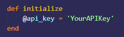

# google-books-ruby-client

A Ruby client for the <a href='https://developers.google.com/books/docs/overview'> Google Books API <a>.

The <a href ='https://books.google.com/'>Google Books</a> website contains a vast resource of information for readers and researchers alike. Its API enables developers to customize searches that are not limited to Book titles only and this client aims to allow a user to fetch resources using the <strong>GET</strong> request which only requires an API key as authentication.

  
<h2>ENDPOINTS</h2>
There are five endpoints for this client, namely:
  <ul>1. Books - gives a list of books containing keywords from the search parameters.</ul>
  <ul>2. Downloads - similar to #1, however, search is limited to books that can be downloaded and accessed thru an ebook reader.</ul>
  <ul>3. Volume ID - gives a single book from the given volume ID. Since each volume ID is unique, is must be explicitly entered by the user.</ul>
  <ul>4. Bookshelves - gives the list of PUBLIC bookshelves of a user. Each bookshelf ID is specific to a user and must be explicitly entered as well. The contents of a boohshelf can be accessed by checking #5.</ul>
  <ul>5. Shelf Volumes - gives the list of books from a user's PUBLIC bookshelf. Parameters should include bookshelf ID and shelf ID (which could be found in a user's bookshelf).</ul>
  
<h2>USAGE</h2>
<ul>1. Before anything else, <a href='https://cloud.google.com/docs/authentication/api-keys?visit_id=637652443905382742-2139937274&rd=1'> generate an API key<a>.</ul>
<ul>2. Fork or download this repo.</ul> 
<ul>3. In your command line, <strong>cd</strong> into the repo and bundle install Faraday and OJ(optional) gems. These are already included in the Gemfile.</ul>
<ul>4. Run the database migrations thru <strong>rake db:migrate</strong>.</ul>
<ul>6. Start the rails server by typing <strong>bin/rails server</strong> or <strong>bin/rails s</strong>.</ul>
<ul>  
  7. In the <strong>client.rb</strong> file under the apps/apis/google_books/v1 directory, input the generated API key here
      <ol>
</img>
</ol>
</ul>
<ul>8. To configure an instance of the client: 
      <ol>
      
<strong>@client = GoogleBooks::V1::Client.new</strong>

      </ol>
 </ul>
<ul>6.Each of the endpoints can be fetched as follows:
    <ol>
      <h4>Books</h4>
      <ol>
@client.book_info('PrideandPrejudice')
</ol>
    </ol>
  <ol>
      <h4>Downloads</h4>
      <ol>
@client.epub('PrideandPrejudice')
</ol>
    </ol>
  <ol>  
      <h4>Volume ID</h4>
      <ol>
@client.volume('zyTCAlFPjgYC')
</ol>
  </ol>
  <ol>
      <h4>Bookshelves</h4>
      <ol>
@client.bookshelf('112895977440900662718')
</ol>
  </ol>
  <ol>  
      <h4>Shelf Volumes</h4>
      <ol>
@client.shelf_volume('112895977440900662718', '1002')
</ol>
  </ol>
</ul>

<ul>There are built-in views for each endpoints, but user can customize as necessary. Please see Ruby on Rails Guides (v6.1.4) on how to configure<a href='https://guides.rubyonrails.org/layouts_and_rendering.html'>views<a>, <a href='https://guides.rubyonrails.org/action_controller_overview.html'> controllers<a>, and<a href='https://guides.rubyonrails.org/routing.html'>routes<a>.</ul>

<h2>ERROR</h2>
  <ul>If the queries are not found, <a href='https://github.com/paula4230/googlebooks-rb-client/blob/main/app/apis/google_books/v1/client.rb'> Runtime Error</a> exception is raised.</ul>

<h2>LIMITATION</h2>

Only five endpoints were featured in this client, but there are other endpoints that can be accessed as well. These require an OAuth token, such as: GET requests to retrieve the lists of all bookshelves of user and POST requests to add and remove books from a user's shelf. For the full lists of all endpoints, please see <a href='https://developers.google.com/books/docs/v1/using#intro'> documentation <a>.

